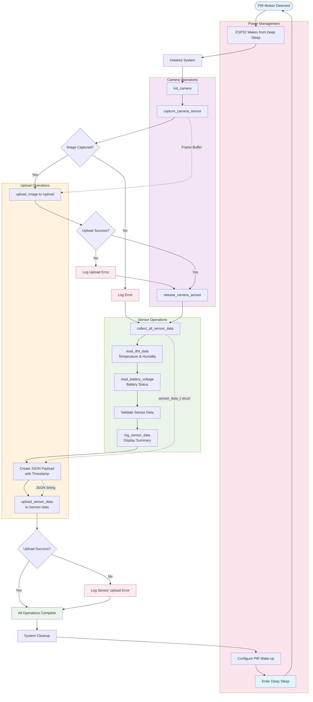

# How to Export the Flow Chart as PNG

## Method 1: Using Mermaid Live Editor

1. Go to [Mermaid Live Editor](https://mermaid.live/)
2. Copy the flow chart code from below and paste it into the editor
3. Click the "Download PNG" button in the top toolbar
4. Save the file as `ESP32_BirdCam_Flow_Chart.png`

## Method 2: Using VS Code with Mermaid Extension

1. Install the "Mermaid Markdown Syntax Highlighting" extension in VS Code
2. Create a new file with `.mmd` extension
3. Paste the flow chart code below
4. Right-click and select "Export to PNG"

## Method 3: Using Command Line (mermaid-cli)

```bash
npm install -g @mermaid-js/mermaid-cli
mmdc -i flowchart.mmd -o ESP32_BirdCam_Flow_Chart.png
```

## Flow Chart Code



---

Once exported as PNG, place the file in your project directory as `ESP32_BirdCam_Flow_Chart.png` to display it in the main documentation file. 